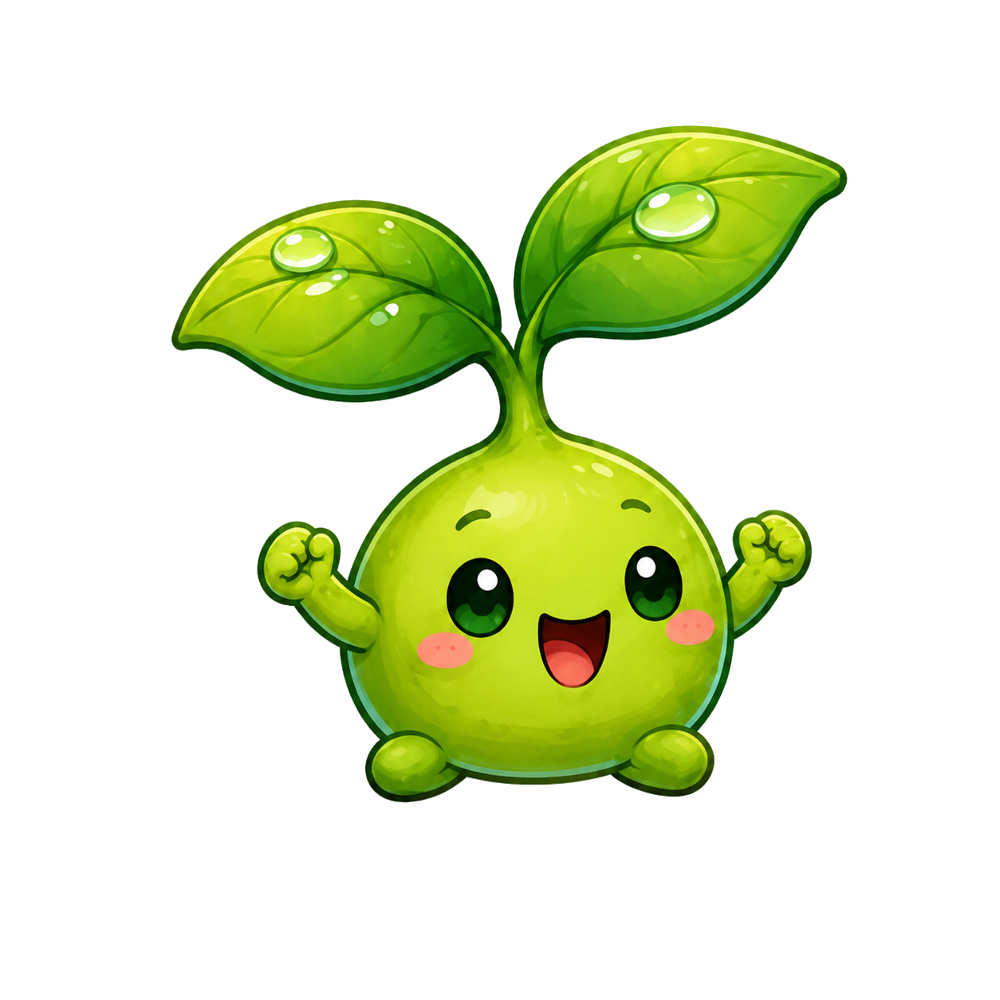
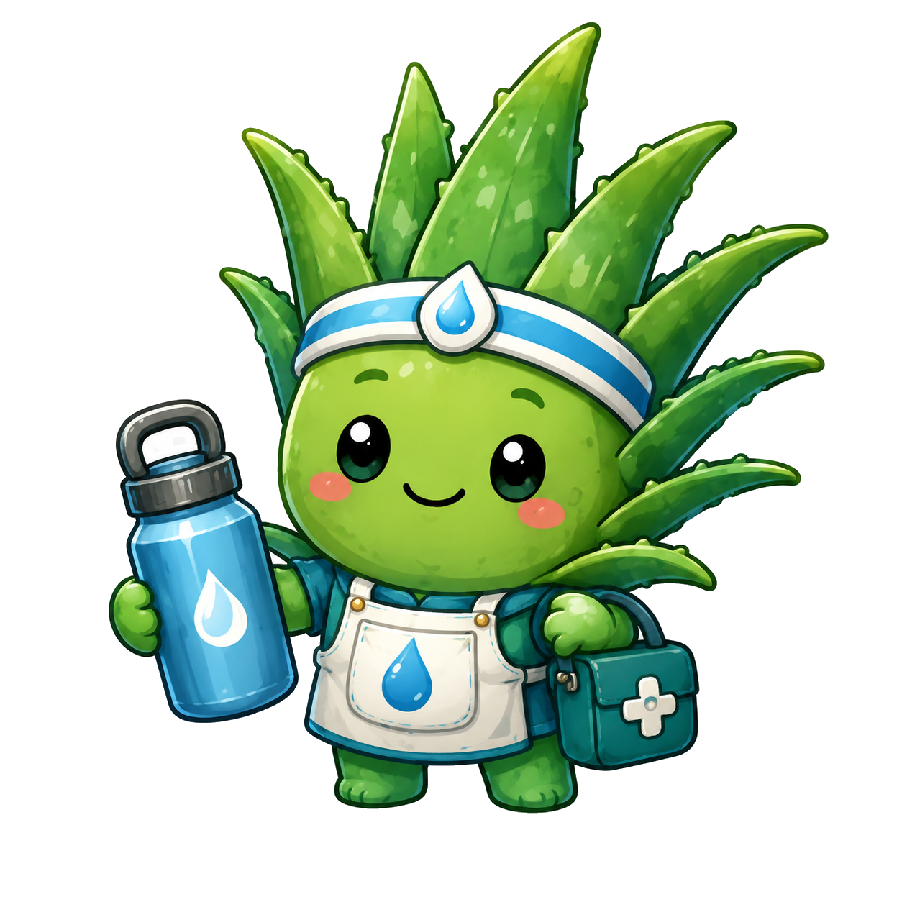
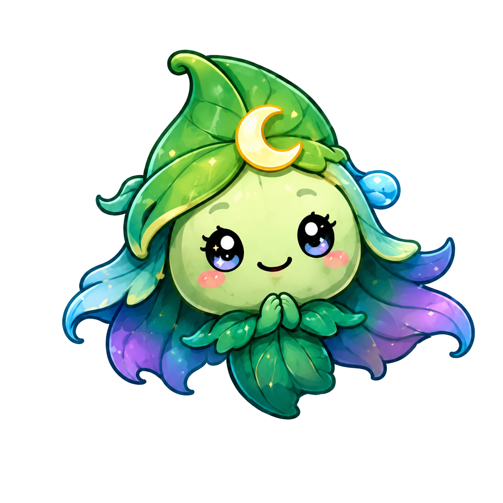

# 🌿 WaterMe

### Smart plant care, made simple

Keep every plant healthy with personalized reminders, AI-powered care guidance, plant identification, and a clear overview of what needs attention today.

---

## 🌱 About WaterMe

**WaterMe** is a native Android app designed to make plant care easier and more consistent. It brings schedules, reminders, plant details, care history, AI-generated guidance, and plant identification together in one friendly experience.

Whether you own one houseplant or an entire indoor jungle, WaterMe helps you understand what each plant needs and what to do next.

<h2 align="center">📱 App Screenshots</h2>

<table>
  <tr>
    <td>
      
    </td>
    <td>
      
    </td>
    <td>
      
    </td>
    <td>
      
    </td>
  </tr>

  <tr>
    <td>
      
    </td>
    <td>
      
    </td>
    <td>
      
    </td>
    <td>
      
    </td>
  </tr>
</table>

## ✨ Highlights

<table>
<tr>
<td width="50%" valign="top">

### 💧 Smart care reminders
Create personalized schedules for watering and fertilizing. See tasks that are due today or overdue and mark them as completed directly in the app.

</td>
<td width="50%" valign="top">

### 🤖 AI Care
Generate practical care guidance for your plants, including light, watering, temperature, humidity, fertilizing, repotting, growth, flowering, toxicity, and origin.

</td>
</tr>
<tr>
<td width="50%" valign="top">

### 📷 Plant Scanner
Identify plants from a photo and review likely matches with common names, scientific names, confidence scores, and related images.

</td>
<td width="50%" valign="top">

### 📖 Care history
Keep a clear record of completed care tasks, notes, and plant health updates so you can follow each plant's progress over time.

</td>
</tr>
<tr>
<td width="50%" valign="top">

### 🪴 Personal plant collection
Add photos, names, species, locations, notes, and custom schedules for every plant in your collection.

</td>
<td width="50%" valign="top">

### 🔔 Local notifications
Receive timely reminders when a plant needs attention, with support for completing, skipping, and snoozing care tasks.

</td>
</tr>
</table>

## 🌈 Meet the WaterMe garden

  
  
  
  
  

Friendly garden characters make everyday plant care more rewarding.

## 📱 Main features

- Add and organize plants with photos, type, location, environment, and notes
- Create custom watering and care schedules
- View today's and overdue tasks in one place
- Complete, skip, or snooze reminders
- Browse upcoming care tasks in a calendar-style agenda
- Review plant care history and health notes
- Identify plants from photos with PlantNet
- Generate and locally cache AI-powered care profiles
- Save useful AI recommendations as reminders or notes
- Use light and dark themes
- Keep core plant data stored locally on the device

## 💚 Project vision

WaterMe is built to turn plant care into a simple daily routine. The goal is a calm, helpful, and visually welcoming app that gives plant owners useful guidance without overwhelming them.

---

Made with 🌿 for plant lovers.

[Download WaterMe](https://play.google.com/store/apps/details?id=com.hotelski.waterme) · [Report an issue](https://github.com/hotelski/WaterMe/issues)

